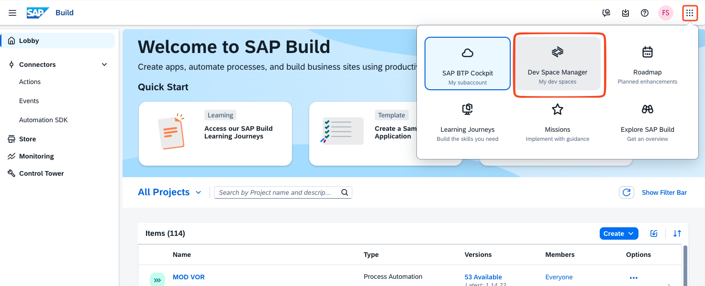
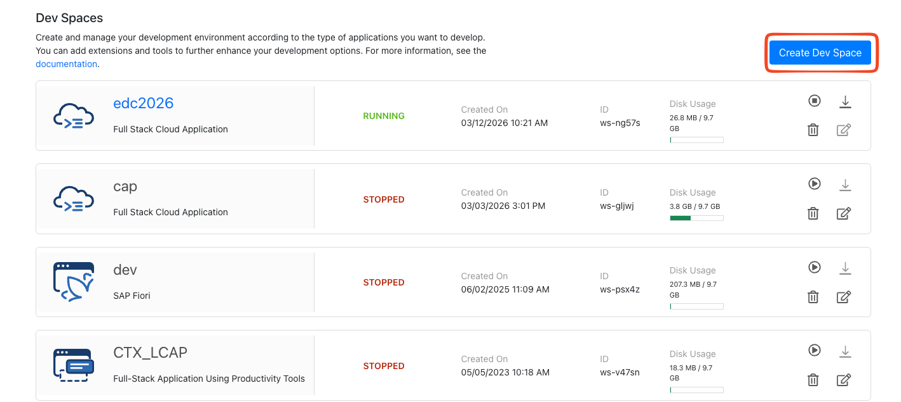
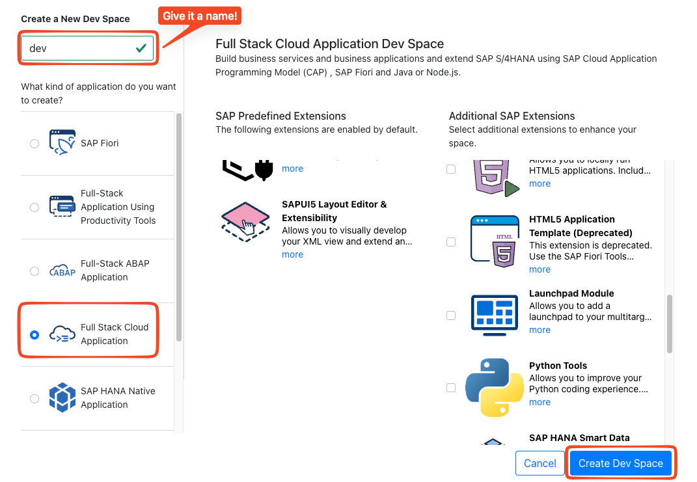
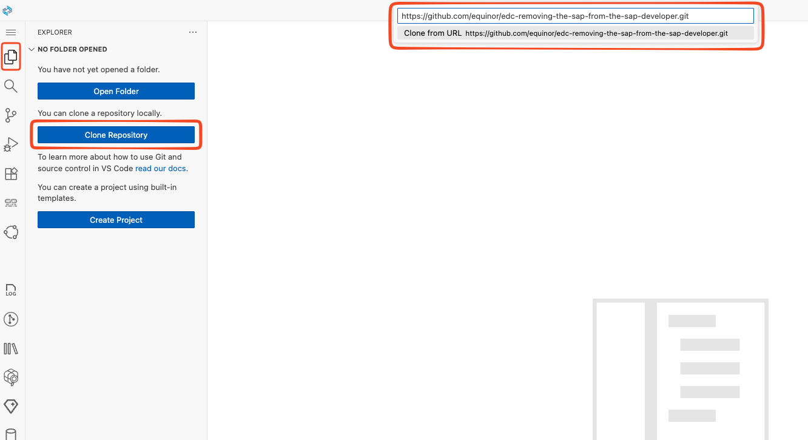
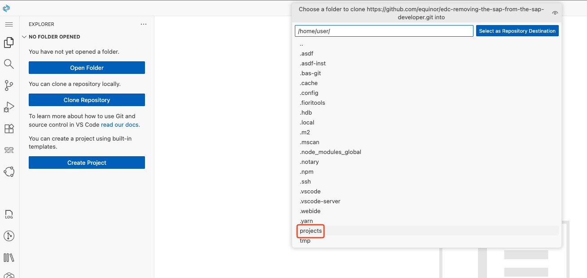

# edc-removing-the-sap-from-the-sap-developer
SAP workshop

1. Welcome - Ingrid Marie
2. Introducing presenters and participants
3. Intro to SAP (erp.equinor.com ) - Frank
4. Intro to CAP excercise - Ingrid Marie
5. CAP Exercise - Ingrid Marie
6. Break ( Lunsj )
7. Using AI with SAP - Frank
8. Intro to AI Excercise - Espen
9. AI Excercise - Espen
10. Closing remarks - Ingrid Marie

## Setting up Business Application Studio (BAS)

BAS is the cloud based IDE from SAP, pre-configured for CAP and UI5 development.

1. Open [SAP Build portal](https://equinor-sbx-cf-aws-application.eu10cf.applicationstudio.cloud.sap/)  (authenticate with "Equinor Azure ID")
2. Create a new Dev space: 
    
    
    
3. Open your Dev space when it is ready
4. Clone the Github repository into BAS. Repository URL is https://github.com/equinor/edc-removing-the-sap-from-the-sap-developer.git

6. Select `projects` folder as destination
 
